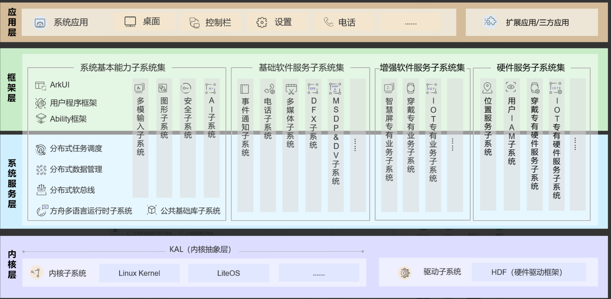

# 04-架构篇

软件架构（software architecture）就是软件的基本结构，合适的架构是软件成功的最重要因素之一。

常见的架构形态：分层架构、事件驱动架构、插件架构、微服务架构、云结构等

而openharmony架构不是特定的那种架构形态，是合理架构形态综合体。

很多时候，由于项目周期的原因，很多开发者并不怎么重视架构的重要性，都是一边实现，一边修正，最终，一代代的修改中，来完善程序。

简单项目无非多耗费点时间来修正，但是对于一个超大型项目来将，忽视架构的重要性，搞到最后肯定是个灾难。

## 总架构图

<figure><figcaption></figcaption></figure>

反复提及总架构，就是一个典型的分层架构。

而其中一个个子服务又是其中一个模块

而一个个子服务又可以扩展为一个个的子服务架构。

## 子服务架构

以几个子服务为例

<figure><figcaption></figcaption></figure>

<figure><figcaption></figcaption></figure>

<figure><figcaption></figcaption></figure>

分别为参与过的telephony子系统、多模输入子服务、系统服务管理子服务

一点点打开，总体基本呈现一种总分关系，一层层的模块，由大到小，共同构成一个完整的openharmony架构。

## Charter\&SOW任务书

了解华为的体系同学们，应该不陌生，IPD的重要环节。

<figure><figcaption></figcaption></figure>

本篇不谈IPD流程，大家只要知道架构起始源头是哪里就好。

## 需求设计

有了任务书，当然就是进入需求设计阶段，需要将任务书中的任务一步步提炼为一个个IR->SR->AR，细分到一个个功能点。

## 概要设计

## 详细设计

## 功能设计

<figure><figcaption></figcaption></figure>

