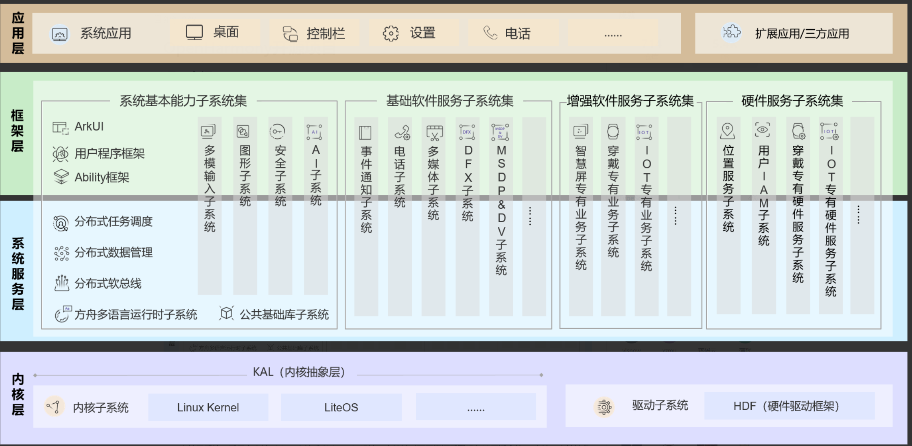

# 04-openharmony架构篇

软件架构（software architecture）就是软件的基本结构，合适的架构是软件成功的最重要因素之一。

常见的架构形态：分层架构、事件驱动架构、插件架构、微服务架构、云结构等

而openharmony架构不是特定的那种架构形态，是合理架构形态综合体。

## 总架构图

<figure><figcaption></figcaption></figure>

反复提及总架构，就是一个典型的分层架构。

而其中一个个子服务又是其中一个模块

而一个个子服务又可以扩展为一个个的子服务架构。

## 子服务架构

以几个子服务为例

参与过的telephony架构

<figure><figcaption></figcaption></figure>

