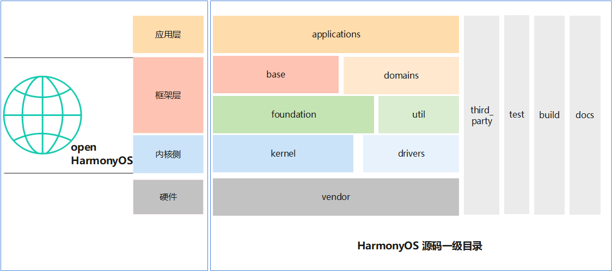

# 05-源码结构

## 源码目录基本结构

<figure><figcaption></figcaption></figure>

## 总结构

由上到下

```sh
├── applications--应用集
├── arkcompiler--方舟运行时
├── base--基础软件服务
├── build--build相关
├── commonlibrary--公共基础库
├── developtools--开发工具集
├── device--芯片&设备包
├── docs--文档
├── domains--特定领域集
├── drivers--驱动系统相关
├── foundation--基本能力子系统集
├── ide--IDE工具
├── interface--接口集
├── kernel--内核
├── napi_generator--napi框架生成工具
├── prebuilts--编译链集
├── productdefine--公共产品形态配置
├── test--测试集
├── third_party--第三方库
└── vendor--设备vendor配置
```

## 关键目录解析

### arkcompiler方舟运行时

```
├── ets_frontend--方舟运行时子系统的前端工具
├── ets_runtime--ArkTS语言运行时
├── runtime_core--方舟编译器运行时
└── toolchain--方舟工具链
```

### base--基础软件服务

```
├── account
│   └── os_account
├── customization
│   ├── config_policy
│   └── enterprise_device_management
├── global
│   ├── i18n
│   ├── i18n_lite
│   ├── resource_management
│   ├── resource_management_lite
│   ├── system_resources
│   └── timezone
├── hiviewdfx
│   ├── blackbox_lite
│   ├── faultloggerd
│   ├── hiappevent
│   ├── hichecker
│   ├── hicollie
│   ├── hidumper
│   ├── hidumper_lite
│   ├── hievent_lite
│   ├── hilog
│   ├── hilog_lite
│   ├── hisysevent
│   ├── hitrace
│   ├── hiview
│   └── hiview_lite
├── inputmethod
│   └── imf
├── iothardware
│   └── peripheral
├── location
├── msdp
│   └── device_status
├── notification
│   ├── common_event_service
│   ├── distributed_notification_service
│   └── eventhandler
├── powermgr
│   ├── battery_lite
│   ├── battery_manager
│   ├── battery_statistics
│   ├── display_manager
│   ├── power_manager
│   ├── powermgr_lite
│   └── thermal_manager
├── print
│   └── print_fwk
├── request
│   └── request
├── security
│   ├── access_token
│   ├── appverify
│   ├── asset
│   ├── certificate_framework
│   ├── certificate_manager
│   ├── code_signature
│   ├── crypto_framework
│   ├── dataclassification
│   ├── device_auth
│   ├── device_security_level
│   ├── dlp_permission_service
│   ├── huks
│   ├── permission_lite
│   ├── security_component_manager
│   └── selinux_adapter
├── sensors
│   ├── medical_sensor
│   ├── miscdevice
│   ├── miscdevice_lite
│   ├── sensor
│   ├── sensor_lite
│   └── start
├── startup
│   ├── appspawn
│   ├── bootstrap_lite
│   ├── hvb
│   └── init
├── tee
│   └── tee_client
├── telephony
│   ├── call_manager
│   ├── cellular_call
│   ├── cellular_data
│   ├── core_service
│   ├── ril_adapter
│   ├── sms_mms
│   ├── state_registry
│   └── telephony_data
├── theme
│   ├── screenlock_mgr
│   └── wallpaper_mgr
├── time
│   └── time_service
├── update
│   ├── packaging_tools
│   ├── sys_installer
│   ├── sys_installer_lite
│   ├── update_app
│   ├── updater
│   └── updateservice
├── usb
│   └── usb_manager
├── useriam
│   ├── face_auth
│   ├── fingerprint_auth
│   ├── pin_auth
│   └── user_auth_framework
└── web
    └── webview
```

### developtools开发工具集

```
├── ace_ets2bundle
├── ace_js2bundle
├── bytrace
├── global_resource_tool
├── hapsigner
├── hdc
├── hiperf
├── integration_verification
├── packing_tool
├── profiler
├── smartperf_host
└── syscap_codec
```

### domains特定领域集

```
└── advertising
    ├── advertising
    └── oaid
```

### drivers驱动相关

```
├── external_device_manager
├── hdf_core
├── interface
├── liteos
└── peripheral
```

### foundation基础能力子系统集

```
├── ability
│   ├── ability_base
│   ├── ability_lite
│   ├── ability_runtime
│   ├── dmsfwk
│   ├── dmsfwk_lite
│   ├── form_fwk
│   └── idl_tool
├── ai
│   ├── ai_engine
│   ├── intelligent_voice_framework
│   ├── mindspore 
│   └── neural_network_runtime
├── arkui
│   ├── ace_engine
│   ├── ace_engine_lite
│   ├── advanced_ui_component
│   ├── napi
│   ├── ui_appearance
│   └── ui_lite
├── barrierfree
│   └── accessibility
├── bundlemanager
│   ├── bundle_framework
│   ├── bundle_framework_lite
│   ├── bundle_tool
│   ├── distributed_bundle_framework
│   └── ecological_rule_manager
├── CastEngine
│   ├── castengine_cast_framework
│   ├── castengine_cast_plus_stream
│   └── castengine_wifi_display
├── communication
│   ├── bluetooth
│   ├── bluetooth_service
│   ├── connected_nfc_tag
│   ├── dhcp
│   ├── dsoftbus
│   ├── ipc
│   ├── netmanager_base
│   ├── netmanager_ext
│   ├── netstack
│   ├── nfc
│   ├── wifi
│   ├── wifi_aware
│   └── wifi_lite
├── deviceprofile
│   └── device_info_manager
├── distributeddatamgr
│   ├── datamgr_service
│   ├── data_object
│   ├── data_share
│   ├── distributedfile
│   ├── kv_store
│   ├── pasteboard
│   ├── preferences
│   ├── relational_store
│   └── udmf
├── distributedhardware
│   ├── device_manager
│   ├── distributed_audio
│   ├── distributed_camera
│   ├── distributed_hardware_fwk
│   ├── distributed_input
│   └── distributed_screen
├── filemanagement
│   ├── app_file_service
│   ├── dfs_service
│   ├── file_api
│   ├── storage_service
│   └── user_file_service
├── graphic
│   ├── graphic_2d
│   ├── graphic_3d
│   ├── graphic_surface
│   ├── graphic_utils_lite
│   └── surface_lite
├── multimedia
│   ├── audio_framework
│   ├── audio_lite
│   ├── av_codec
│   ├── av_session
│   ├── camera_framework
│   ├── camera_lite
│   ├── drm_framework
│   ├── image_framework
│   ├── media_foundation
│   ├── media_library
│   ├── media_lite
│   ├── media_utils_lite
│   └── player_framework
├── multimodalinput
│   └── input
├── resourceschedule
│   ├── background_task_mgr
│   ├── device_standby
│   ├── device_usage_statistics
│   ├── ffrt
│   ├── frame_aware_sched
│   ├── memmgr
│   ├── qos_manager
│   ├── resource_schedule_service
│   └── work_scheduler
├── systemabilitymgr
│   ├── safwk
│   ├── safwk_lite
│   ├── samgr
│   └── samgr_lite
└── window
    ├── window_manager
    └── window_manager_lite
```

